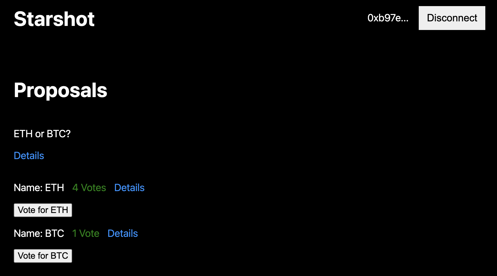

# Starshot

### Description
With the increasing effectiveness of L2 solutions for Ethereum, it is likely that on-chain voting will occur more often.

The current most popular voting solution, Snapshot, does not have voting on chain.
I have created Starshot, a simple Dapp for on-chain voting.

### Admin flow
*Note: must be owner of contract*
1. Create a proposal and list the options that can be voted on

### User flow
1. Login with Metamask
2. Vote for one option for the specified proposal.

### Video Demo
[demo](https://youtu.be/p1juVNKOWVU)

### Directory structure
- `contracts/` contains the `Vote.sol` contract.
- `test/` containts the `vote.ts` testing script.
- `scripts/` contains the `deploy.ts` deployment script and populates a sample proposal.
- `frontend` contains the frontend.

### How to Run 
1. `git clone https://github.com/cha0sg0d/blockchain-developer-bootcamp-final-project.git`
2. `yarn`
3. `yarn hardhat test`
4. 

### Verified Public Contract on Rinkeby
[contract](https://rinkeby.etherscan.io/address/0x697E6d5f8053Af5AeE6cD6f7eCEb81764CfCB84f)

### Public Ethereum address
`tonygoss.eth`

